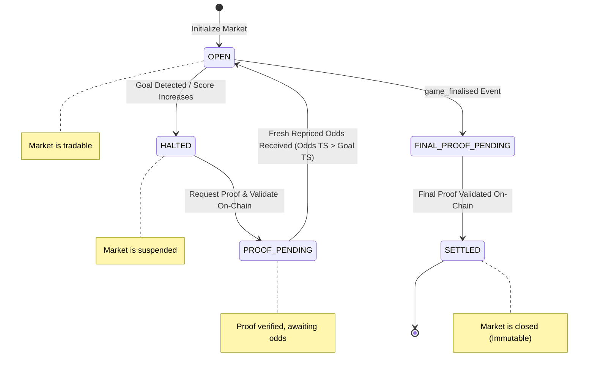

# ProofGuard: Solana Risk Circuit Breaker Agent 🛡️

ProofGuard is a production-grade **Autonomous Sports Agent & Risk Circuit Breaker** built for the **TxODDS World Cup Hackathon on Solana**. It monitors real-time soccer odds and score feeds using **TxLINE**, automatically halts virtual betting markets when a goal occurs, retrieves cryptographic Merkle proofs validating the event, settles/verifies them on-chain using the Anchor program on Devnet, and reopens the market once fresh repriced odds are received.

It comes with an interactive, responsive **Next.js + Tailwind CSS Dashboard** that provides full visibility of the goal-to-halt-to-proof-to-reopen lifecycle without requiring a wallet connection.

---

## 🏗️ System Architecture & State Machine



### 1. Ingestion & Normalization
* Standardized, typed payloads map both uppercase and lowercase variants (`Seq`/`seq`, `FixtureId`/`fixtureId`).
* Rejects malformed updates (e.g. sequence = 0) and generates stable deduplication keys to guarantee processing updates exactly once.

### 2. State Machine Rules
* **Goal Rule:** Halts the market (`OPEN` -> `HALTED`) when a scoring update occurs.
* **On-Chain validation:** Submits Merkle proof validation requests to the Solana program on devnet for the daily roots PDA, validating the event cryptographic validity.
* **Repricing & Reopening:** Evaluates when a repriced odds update arrives after the goal timestamp, restoring the market back to `OPEN` safely.
* **Finalisation Rule:** Transitions the market to `SETTLED` once the match ends and the final result is confirmed on-chain.

---

## ⚡ Quickstart

### 1. Clone & Install Dependencies
Ensure you have Node.js >= 20. Install the root agent and dashboard dependencies:
```bash
# Install backend dependencies
yarn install

# Install dashboard dependencies
cd dashboard && yarn install && cd ..
```

### 2. Configure Environment Variables
Copy `.env.example` to `.env` in the root directory:
```bash
cp .env.example .env
```
Fill in the details. The verify setup script will help check these.

### 3. Generate Wallet & Request Airdrop
Generate a local testing wallet keyfile and top it up:
```bash
# Generate keyfile at _keys/wallet.json
yarn ts-node scripts/generate_wallet.ts

# Top up the generated wallet address with 1 SOL on Devnet
# Go to https://faucet.solana.com/ and request Devnet SOL
```

### 4. Verify Configuration
Run the setup check script:
```bash
yarn ts-node scripts/verify_setup.ts
```

### 5. On-Chain Subscription & API Activation
Create your TxLINE on-chain subscription and activate your API token:
```bash
# Execute devnet subscription
yarn ts-node scripts/subscribe.ts

# Activate the API token using the signature output from the subscription step
yarn ts-node scripts/activate.ts <TRANSACTION_SIGNATURE>
```
*Your `X_API_TOKEN` is automatically written to your `.env` file!*

---

## 🚀 Running the Application

### Running backend agent & Express server
```bash
# Starts the Express API server (port 8080) and SSE stream listeners
yarn start
```

### Running frontend UI dashboard
```bash
cd dashboard
yarn dev
```
Open **[http://localhost:3000](http://localhost:3000)** in your browser to view the dashboard!

---

## 🧪 Testing

Run the automated unit and integration tests verifying normalization, state transitions, and security redactions:
```bash
yarn test
```

To run a dry run stream check:
```bash
yarn ts-node scripts/test_stream.ts
```

To run a live historical Merkle validation transaction:
```bash
yarn ts-node scripts/validate_historical.ts
```

---

## 🛠️ Solana Devnet Integrations
* **Program ID:** `6pW64gN1s2uqjHkn1unFeEjAwJkPGHoppGvS715wyP2J`
* **TxL Token Mint:** `4Zao8ocPhmMgq7PdsYWyxvqySMGx7xb9cMftPMkEokRG`
* **Daily Merkle Roots PDA derivation:**
  ```typescript
  const [dailyScoresPda] = PublicKey.findProgramAddressSync(
    [
      Buffer.from("daily_scores_roots"),
      new BN(epochDay).toArrayLike(Buffer, "le", 2),
    ],
    program.programId
  );
  ```
* **Solana receipt transaction:** [AmTT9ceQ2yT8E9C1TYjsPMWyAQqd6moyVYivcAfXAsHCeqtnJNAcP3hM3PJphc1AyhRzBJrSUwit9bCP9fEeTP8](https://explorer.solana.com/tx/AmTT9ceQ2yT8E9C1TYjsPMWyAQqd6moyVYivcAfXAsHCeqtnJNAcP3hM3PJphc1AyhRzBJrSUwit9bCP9fEeTP8?cluster=devnet)
